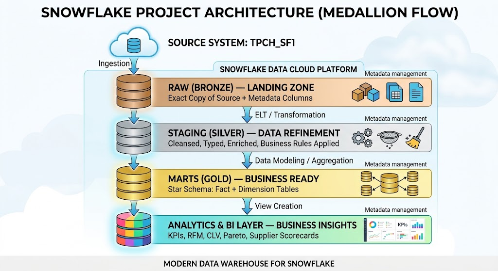

<div align="center">

# 🏔️ RetailDW
### End-to-End Retail Analytics Data Warehouse on Snowflake

*Medallion Architecture · Star Schema · TPC-H Benchmark Dataset (8.6M+ rows)*

[](https://www.snowflake.com/)[cite: 1, 2]
[](.)[cite: 1, 2]
[](.)[cite: 1, 2]
[](.)[cite: 2]
[](.)[cite: 2]

</div>

---

## 📋 Table of Contents
- [🔎 Overview](#-overview)[cite: 2]
- [📊 Dataset](#-dataset)[cite: 2]
- [🏗️ Architecture](#-architecture)[cite: 2]
- [⚙️ Key Features](#-key-features)[cite: 2]
- [🧠 Engineering Notes: Standard Edition Adaptations](#-engineering-notes-standard-edition-adaptations)[cite: 2]
- [📈 Analytics in Action](#-analytics-in-action)[cite: 2]
- [🛠️ Tech Stack](#-tech-stack)[cite: 2]
- [📁 Repository Structure](#-repository-structure)[cite: 2]
- [⚡ Quick Start](#-quick-start)[cite: 2]
- [🌟 What I Learned](#-what-i-learned)[cite: 2]

---

## 🔎 Overview

**RetailDW** is a production-style Retail Analytics Data Warehouse built entirely on Snowflake, implementing a full **Medallion Architecture** (Bronze → Silver → Gold → Analytics) to turn 8.6M+ raw transactional rows into customer, product, and supply-chain insights.

Everything here — ingestion, modeling, security, automation, and analytics — runs on a single free-tier Snowflake trial account, executed end-to-end from the CLI.

---

## 📊 Dataset

**TPC-H Benchmark Data** — built into every Snowflake account at `SNOWFLAKE_SAMPLE_DATA.TPCH_SF1`. No download, no external source, no setup friction. Anyone with a free Snowflake trial can reproduce this project exactly.

| Table | Rows | Description |
|-------|-----:|-------------|
| ORDERS | 1,500,000 | Customer purchase orders |
| LINEITEM | 6,001,215 | Individual order line items |
| CUSTOMER | 150,000 | Customer master data |
| SUPPLIER | 10,000 | Supplier master data |
| PART | 200,000 | Product/parts catalog |
| PARTSUPP | 800,000 | Part–supplier relationships |
| NATION / REGION | 30 | Geography reference |

**Business story:** A global retail & supply chain company, modeled from raw source data through to executive-level analytics.

---

## 🏗️ Architecture

<div align="center">
  
</div>
<br>

The pipeline moves data through four layers, each with a distinct job:

```text
SNOWFLAKE_SAMPLE_DATA (source)
        │
        ▼
┌──────────────────────────────────────────────────────┐
│                  RETAIL_DW database                  │
│                                                      │
│  ┌────────┐   ┌──────────┐   ┌────────┐  ┌─────────┐ │
│  │  RAW   │ → │ STAGING  │ → │ MARTS  │→ │ANALYTICS│ │
│  │(Bronze)│   │ (Silver) │   │ (Gold) │  │         │ │
│  └────────┘   └──────────┘   └────────┘  └─────────┘ │
│                                                      │
│  ┌──────────────┐      ┌──────────────────┐          │
│  │  MONITORING  │      │  Advanced Layer  │          │
│  │ (DQ + Logs)  │      │ Streams / Tasks  │          │
│  └──────────────┘      └──────────────────┘          │
└──────────────────────────────────────────────────────┘
Star schema (MARTS layer):  Plaintext                    DIM_DATE
                       │
DIM_CUSTOMERS ─── FACT_ORDERS
                       │
                  FACT_LINEITEM ─── DIM_PRODUCTS
                       │
                   DIM_SUPPLIERS[cite: 1, 2]
Grain: FACT_LINEITEM — one row per order line item  Conformed dimension: DIM_DATE joins to order, ship, commit, and receipt dates  ⚙️ Key FeaturesFeatureImplementationMedallion ArchitectureRAW → STAGING → MARTS → ANALYTICS[cite: 1, 2]Star Schema Modeling2 fact tables, 4 dimension tables[cite: 1, 2]Window FunctionsYoY/MoM revenue growth, RFM scoring, Pareto analysis, CLV[cite: 1, 2]Streams & TasksCDC pipeline with hourly incremental sync[cite: 1, 2]Time TravelHistorical point-in-time queries and recovery pattern[cite: 1, 2]Zero-Copy CloningInstant DEV/TEST database and table clones[cite: 1, 2]Scheduled Aggregate RefreshTask-driven refresh tables (materialized-view equivalent)  Role-Based Data MaskingSecure views enforcing masking via CURRENT_ROLE()  Region-Based Row FilteringSecure view row filtering (row-access-policy equivalent)  RBAC4-tier role hierarchy (Admin → Engineer → Analyst → Viewer)[cite: 1, 2]Data Quality7-check automated DQ suite with result logging[cite: 1, 2]Stored ProceduresJavaScript-based pipeline automation[cite: 1, 2]🧠 Engineering Notes: Standard Edition AdaptationsThis project runs on Snowflake Standard Edition (free trial) — which doesn't include two Enterprise+ features that most reference architectures assume: native Materialized Views and Dynamic Data Masking / Row Access Policies. Rather than skip these capabilities, they were rebuilt using patterns available on every Snowflake edition:  Enterprise+ FeatureStandard Edition Equivalent Built HereCREATE MATERIALIZED VIEWA regular table + a TASK on a CRON schedule calling a stored procedure to rebuild it  CREATE MASKING POLICYA SECURE VIEW with a CASE WHEN CURRENT_ROLE() ... expression per column  CREATE ROW ACCESS POLICYA SECURE VIEW with a CASE WHEN CURRENT_ROLE() ... expression in the WHERE clause  End-user behavior is identical — different roles see different data — but every line of SQL runs on a $0 account. This constraint-driven substitution was one of the more useful parts of building the project.  📈 Analytics in ActionSales KPIs — Revenue, MoM & YoY Growth  Revenue, order counts, and units sold aggregated by year/quarter/month, with month-over-month and year-over-year growth calculated via LAG() window functions.  RFM Customer Segmentation  Customers scored 1–5 on Recency, Frequency, and Monetary value using NTILE(5), then labeled into segments — Champions, Loyal, At-Risk, Lost — for retention targeting.  Product Performance — ABC / Pareto Analysis  Products ranked by revenue contribution with a running cumulative percentage, classifying each into A/B/C tiers using the 80/20 Pareto rule.  Supplier Scorecard  A composite 100-point supplier score blending on-time delivery rate, return rate, and average delivery speed.  Role-Based Masking, Verified  The same VW_CUSTOMERS_MASKED view, queried as RETAIL_ADMIN (full data) vs. RETAIL_VIEWER (masked name and phone) — proof the role-based protection actually works.  💡 Save your Snowsight screenshots into docs/screenshots/ using the filenames above, or rename them to match — see the setup note at the end of this file.  🛠️ Tech StackSnowflake — Cloud Data Warehouse (Standard Edition)[cite: 1, 2]SnowSQL — CLI for script execution and automation  VS Code + Snowflake Extension — primary editor, integrated terminal[cite: 1, 2]SQL — standard SQL + Snowflake Scripting (JavaScript stored procedures)[cite: 1, 2]Git / GitHub — version control, phase-by-phase commit history  📁 Repository StructurePlaintextsnowflake-retail-analytics/[cite: 1, 2]
├── setup/          → Warehouses, databases, RBAC roles[cite: 1, 2]
├── raw/            → Bronze layer: source ingestion[cite: 1, 2]
├── staging/        → Silver layer: cleansing + enrichment[cite: 1, 2]
├── marts/          → Gold layer: star schema[cite: 1, 2]
│   ├── dimensions/ → DIM_DATE, DIM_CUSTOMERS, DIM_PRODUCTS, DIM_SUPPLIERS
│   └── facts/      → FACT_ORDERS, FACT_LINEITEM[cite: 1, 2]
├── analytics/      → Business views: KPIs, RFM, CLV, Pareto, supplier scorecard
├── advanced/       → Streams, Tasks, Time Travel, Cloning, secure views
├── monitoring/     → Automated data quality checks[cite: 1, 2]
└── docs/
    ├── architecture-diagram.jpg
    └── screenshots/
        ├── sales-kpis.png
        ├── rfm-segmentation.png
        ├── product-performance.png[cite: 2]
        ├── supplier-scorecard.png[cite: 2]
        └── secure-view-masking.png[cite: 2]
⚡ Quick StartSign up for a free Snowflake trial (Standard Edition is enough — this whole project runs on it)[cite: 2].Clone this repo[cite: 1, 2].Run scripts in order: setup/ → raw/ → staging/ → marts/ (dimensions before facts) → analytics/ → advanced/ → monitoring/[cite: 2].Explore the analytics views in Snowsight or any BI tool[cite: 2].Gotcha: Accounts created via signup.snowflake.com use the hyphenated account identifier format (orgname-accountname), not the legacy dot format[cite: 2]. Use the exact value from Snowsight → Account → Account Identifier[cite: 2].🌟 What I LearnedDesigning a multi-layer data warehouse from raw ingestion through to business-ready analytics views[cite: 2].Writing analytical SQL beyond basic queries: window functions, CTEs, RFM scoring, Pareto/ABC classification[cite: 2].Diagnosing real platform constraints and rebuilding Enterprise-only features (materialized views, masking/row-access policies) using Standard-Edition-compatible patterns[cite: 2].Setting up RBAC from scratch: warehouses, databases, schemas, and a 4-tier role hierarchy with future grants[cite: 2].Automating data quality validation with stored procedures and a persistent results log[cite: 2].Running the entire build from the CLI (SnowSQL + PowerShell), including debugging account identifiers, authentication, and reserved-keyword SQL errors along the way[cite: 2].
