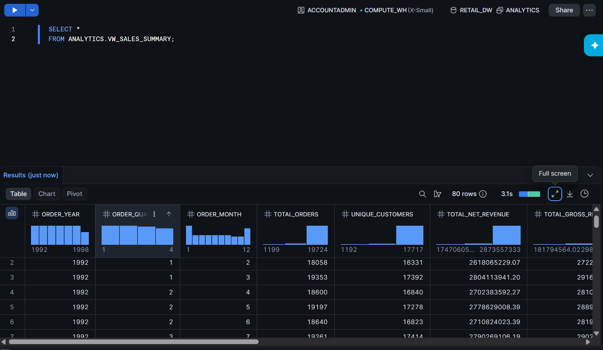
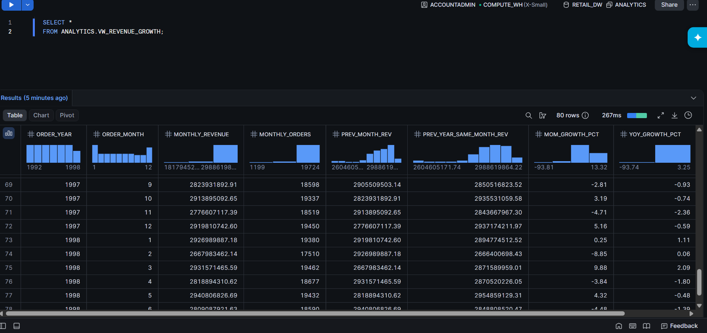
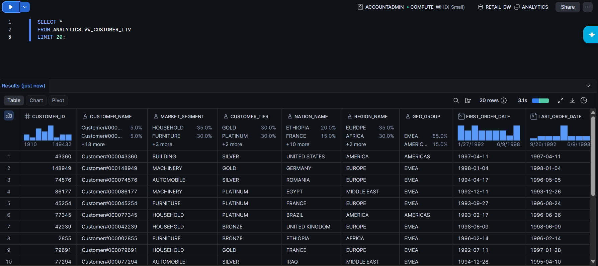
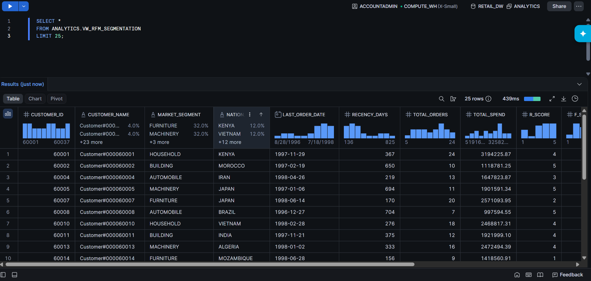
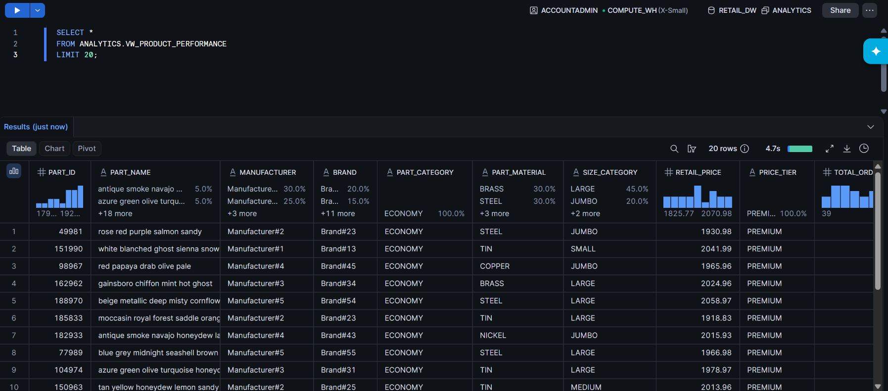

<div align="center">

# 🏔️ RetailDW

### End-to-End Retail Analytics Data Warehouse on Snowflake

**Production-Ready Data Warehouse built using Snowflake's Medallion Architecture**

[](https://www.snowflake.com/)


</div>

---

## 📖 Overview

RetailDW is a production-style **Retail Analytics Data Warehouse** built entirely on **Snowflake** using the **Medallion Architecture (Bronze → Silver → Gold)**.

The project processes **8.6M+ retail records** from the Snowflake TPC-H benchmark dataset and transforms them into business-ready analytical models using dimensional modeling, advanced SQL, and Snowflake-native capabilities.

It demonstrates how modern cloud data warehouses are designed for scalability, security, and analytics.

---

## ✨ Project Highlights

- 🏗️ Medallion Architecture
- ⭐ Star Schema
- 📊 8.6 Million+ Records
- 📈 Customer Analytics
- 🎯 RFM Segmentation
- 📦 Product Performance Analysis
- 🚚 Supplier Scorecards
- 🔄 Streams & Tasks
- ⏳ Time Travel
- 🧬 Zero-Copy Cloning
- 🔐 Secure Views & RBAC
- ✅ Data Quality Monitoring

---

## 📊 Dataset

The project uses the built-in Snowflake benchmark dataset.

```
SNOWFLAKE_SAMPLE_DATA.TPCH_SF1
```

| Table | Rows |
|------|------:|
| ORDERS | 1,500,000 |
| LINEITEM | 6,001,215 |
| CUSTOMER | 150,000 |
| SUPPLIER | 10,000 |
| PART | 200,000 |
| PARTSUPP | 800,000 |

**Total Data Processed:** **8.6M+ Rows**

---

# 🏗️ Architecture

The warehouse follows a Medallion Architecture that separates raw ingestion, transformations, dimensional modeling, and business analytics into independent layers.

<p align="center">

</p>

---

## ⭐ Star Schema

```
                 DIM_DATE
                     │
DIM_CUSTOMERS ─ FACT_ORDERS
                     │
              FACT_LINEITEM
               │         │
      DIM_PRODUCTS  DIM_SUPPLIERS
```

Fact Tables

- FACT_ORDERS
- FACT_LINEITEM

Dimension Tables

- DIM_CUSTOMERS
- DIM_PRODUCTS
- DIM_SUPPLIERS
- DIM_DATE

---

# 🚀 Features

| Feature | Description |
|---------|-------------|
| Medallion Architecture | Bronze → Silver → Gold Pipeline |
| Star Schema | Fact & Dimension Modeling |
| Analytics Views | Business-ready reporting layer |
| Window Functions | LAG, NTILE, SUM OVER, RANK |
| Streams | Change Data Capture |
| Tasks | Pipeline Automation |
| Time Travel | Historical Queries |
| Zero-Copy Cloning | Development & Testing |
| Secure Views | Data Masking |
| RBAC | Multi-role Security |
| Data Quality | Automated Validation |

---

# 📈 Analytics Layer

The **Analytics** schema contains business-ready views that can be directly consumed by BI tools such as **Power BI**, **Tableau**, or **Streamlit**.

---

## 💰 Sales KPI Dashboard

Provides a high-level summary of business performance.

Metrics include:

- Total Revenue
- Gross Revenue
- Total Orders
- Average Order Value
- Units Sold
- Return Rate
- On-Time Delivery Rate

<p align="center">

</p>

---

## 📈 Revenue Growth Analysis

Tracks business performance over time using SQL window functions.

Metrics include:

- Monthly Revenue
- Quarterly Revenue
- Yearly Revenue
- Month-over-Month Growth
- Year-over-Year Growth
- Year-To-Date Revenue

<p align="center">

</p>

---

## 👥 Customer Lifetime Value (CLV)

Ranks customers based on their overall contribution to the business.

Metrics include:

- Lifetime Revenue
- Purchase Frequency
- Customer Tenure
- Monthly Revenue Rate
- Revenue Percentile

<p align="center">

</p>

---

## 🎯 RFM Segmentation

Customers are segmented based on:

- **Recency**
- **Frequency**
- **Monetary Value**

Generated customer segments include:

- Champions
- Loyal Customers
- Potential Loyalists
- At Risk
- Lost Customers

<p align="center">

</p>

---

# 🛠️ Tech Stack

| Category | Technology |
|----------|------------|
| Cloud Data Warehouse | Snowflake |
| Query Language | Snowflake SQL |
| Stored Procedures | JavaScript |
| Automation | Streams & Tasks |
| Data Modeling | Star Schema |
| Architecture | Medallion Architecture |
| CLI | SnowSQL |
| IDE | VS Code |
| Version Control | Git & GitHub |

---

# 🚀 Quick Start

## 1. Clone the Repository

```bash
git clone https://github.com/<your-username>/RetailDW.git

cd RetailDW
```

---

## 2. Create a Snowflake Account

Create a free Snowflake trial account.

The project is fully compatible with **Snowflake Standard Edition**.

---

## 3. Configure SnowSQL (Optional)

```bash
snowsql -a <account_identifier> -u <username>
```

---

## 4. Execute SQL Scripts

Run the SQL scripts in the following order:

```
setup/
   ↓
raw/
   ↓
staging/
   ↓
marts/
   ↓
analytics/
   ↓
advanced/
   ↓
monitoring/
```

---

# 🧪 Sample SQL Queries

### Sales Summary

```sql
SELECT *
FROM ANALYTICS.VW_SALES_SUMMARY;
```

---

### Revenue Growth

```sql
SELECT *
FROM ANALYTICS.VW_REVENUE_GROWTH;
```

---

### Customer Lifetime Value

```sql
SELECT *
FROM ANALYTICS.VW_CUSTOMER_LTV
LIMIT 20;
```

---

### RFM Segmentation

```sql
SELECT *
FROM ANALYTICS.VW_RFM_SEGMENTATION
LIMIT 20;
```

---

### Product Performance

```sql
SELECT *
FROM ANALYTICS.VW_PRODUCT_PERFORMANCE
LIMIT 20;
```

---

# 📚 SQL Concepts Demonstrated

This project makes extensive use of advanced SQL features, including:

- Common Table Expressions (CTEs)
- Window Functions
- CASE Expressions
- Aggregate Functions
- Ranking Functions
- Date Functions
- Conditional Aggregation
- Multi-table Joins
- Views
- Stored Procedures
- Streams
- Tasks

---

# 📖 Key Learnings

Through this project, I gained hands-on experience in:

- Designing production-ready cloud data warehouses
- Implementing the Medallion Architecture
- Building Star Schema dimensional models
- Writing advanced analytical SQL
- Using window functions for business analytics
- Implementing Snowflake security using RBAC and Secure Views
- Automating pipelines with Streams & Tasks
- Applying Time Travel and Zero-Copy Cloning
- Building a data quality validation framework

---

# 💡 Challenges & Solutions

| Challenge | Solution |
|-----------|----------|
| Managing large datasets | Layered Medallion Architecture |
| Enterprise features unavailable in Standard Edition | Recreated using Secure Views, Tasks, and Stored Procedures |
| Customer data security | Role-Based Access Control & Secure Views |
| Incremental processing | Snowflake Streams |
| Pipeline automation | Snowflake Tasks |
| Data consistency | Automated Data Quality Checks |

---

# 🚀 Future Improvements

Some planned enhancements include:

- Integrate **dbt** for modular transformations
- Orchestrate pipelines using **Apache Airflow**
- Build interactive dashboards with **Power BI**
- Add **Snowpark** for Python-based transformations
- Implement **GitHub Actions** for CI/CD
- Provision infrastructure using **Terraform**
- Add automated SQL unit testing
- Integrate real-time ingestion using **Snowpipe Streaming**

---

# ⭐ Why This Project?

This project was built to simulate how a modern enterprise data warehouse is designed and managed using Snowflake.

It demonstrates not only SQL proficiency but also practical knowledge of:

- Data Modeling
- Cloud Data Warehousing
- Security
- Automation
- Performance Optimization
- Business Analytics

The repository is intended as a portfolio project showcasing end-to-end data engineering skills.

---

# 👨‍💻 Author

## Nayan Jain

**Aspiring Data Engineer | Data Analyst**

I'm passionate about building scalable data platforms, cloud-based data warehouses, and real-time data pipelines.

Feel free to connect with me:

- 🔗 LinkedIn: **https://www.linkedin.com/in/nayan-jain007/**
- 💻 GitHub: **https://github.com/NAYANJ7**

---

<div align="center">

### ⭐ If you found this project helpful, consider giving it a star!

**Built with Snowflake ❄️, SQL, and ☕**

</div>

## 📦 Product Performance

Evaluates products using revenue and sales metrics.

Includes:

- Revenue Ranking
- Units Sold
- Revenue Contribution
- Pareto (ABC Classification)

<p align="center">

</p>

---

# ⚡ Advanced Snowflake Features

RetailDW demonstrates several Snowflake-native capabilities commonly used in enterprise environments.

### 🔄 Streams

Implements **Change Data Capture (CDC)** for incremental processing.

- Detects Inserts
- Detects Updates
- Detects Deletes

---

### ⏰ Tasks

Automates SQL execution using scheduled jobs.

Used for:

- Incremental Refreshes
- Aggregate Updates
- Pipeline Automation

---

### ⏳ Time Travel

Allows querying historical versions of data.

Benefits:

- Historical Analysis
- Data Recovery
- Point-in-Time Queries

---

### 🧬 Zero-Copy Cloning

Creates instant copies of databases without duplicating storage.

Used for:

- Development
- Testing
- Backup

---

### 🔐 Secure Views

Sensitive customer information is protected using Secure Views.

Depending on the active role:

- Admin → Full Access
- Analyst → Partial Access
- Viewer → Masked Data

---

### 👤 Role-Based Access Control (RBAC)

Implements a hierarchical role model.

```
ACCOUNTADMIN
      │
RETAIL_ADMIN
      │
RETAIL_ENGINEER
      │
RETAIL_ANALYST
      │
RETAIL_VIEWER
```

---

### ✅ Data Quality Monitoring

The Monitoring layer validates data using automated checks.

Examples include:

- Null Detection
- Duplicate Detection
- Row Count Validation
- Primary Key Checks
- Foreign Key Validation

---

# 📂 Repository Structure

```text
RetailDW/
│
├── setup/
├── raw/
├── staging/
├── marts/
│   ├── dimensions/
│   └── facts/
├── analytics/
├── advanced/
├── monitoring/
├── docs/
└── README.md
```

---

# ▶️ Execution Flow

Execute the project in the following order:

```
setup/
   ↓
raw/
   ↓
staging/
   ↓
marts/
   ↓
analytics/
   ↓
advanced/
   ↓
monitoring/
```

---

# 📸 Project Screenshots

The repository contains screenshots demonstrating different stages of the warehouse.

| Screenshot | Description |
|------------|-------------|
| Architecture | Complete Medallion Architecture |
| Sales KPIs | Executive business metrics |
| Revenue Growth | MoM & YoY Analysis |
| Customer LTV | Customer ranking |
| RFM Segmentation | Customer segmentation |
| Product Performance | Revenue & Pareto analysis |

---
